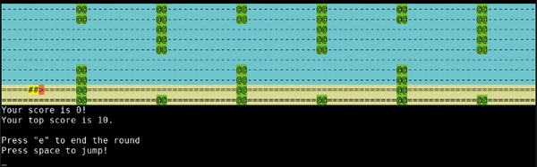
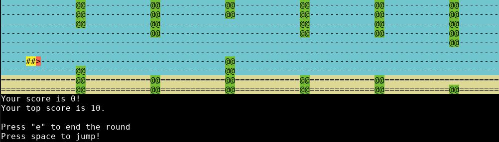

# Flappy Bird Terminal Game

## Table of contents
* [Overview](#overview)
* [Examples](#examples)
* [Technologies](#technologies)
* [Setup](#setup)
* [Limitations](#limitations)

## Overview
This is a program where you can play Flappy Bird in your terminal. The program uses ASCII characters to represent light and dark, and True Colour for colour.

## Examples
### Screenshots of Terminal

    > The game shown in the terminal

    > Beginning a game

## Technologies
- **Python 3.8**
- **Json**
  - for storing the users' top score of all time
- **keyboard 0.13**
  - for getting input without halting the program
  - note this requires root permissions
- **Ansi Escape Sequences**
  - for converting *RGB* colour to colour representable in terminals
  - This program uses True Colour

## Setup
To run this project, install the requirements and then run the program:

    pip3 install -r requirements
    sudo python convert.py

Notice the program requires root permissions because of the **keyboard** library

## Limitations
- [ ] True Colour is not supported on all terminals
- [ ] **keyboard** requires root access which objectively seems pretty sketchy :)
  - note this is because `input()` halts the program so it would not be possible to load the next frame if nothing is inputted
- [ ] Program always has one hundred columns and 10 rows regardless of window size

## License
Liscensed under the [GNU General Public License v3.0](LICENSE)
